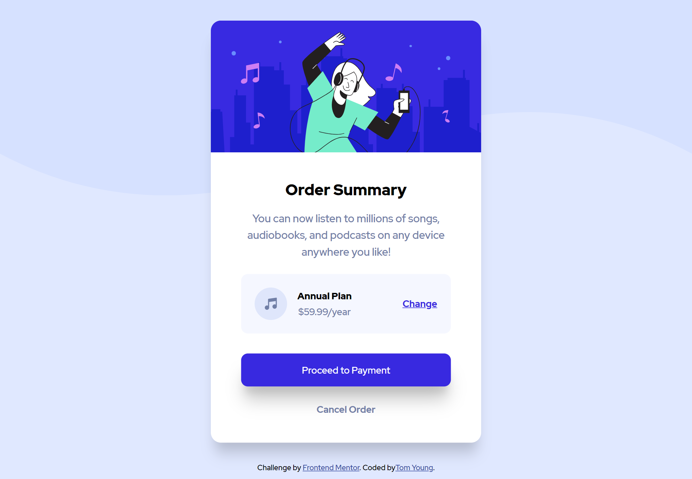

# Frontend Mentor - Order summary card solution

This is a solution to the [Order summary card challenge on Frontend Mentor](https://www.frontendmentor.io/challenges/order-summary-component-QlPmajDUj).

## Table of contents

- [Overview](#overview)
  - [Links](#links)
  - [Screenshots](#screenshots)
- [My process](#my-process)
  - [Built with](#built-with)
  - [Useful resources](#useful-resources)
- [Author](#author)

## Overview

### Links

- Live Site URL: [GitHubPage](https://thethomasy.github.io/Order-Summary-Card/)

### Screenshots

## My process

Card was built mobile first and then made to expand on larger screens. There is not a huge change but it definitely helps. The background image also changes between mobile and desktop.

### Built with

- HTML
- SASS
- Flexbox
- Mobile-first workflow

### Useful resources

Very useful resource for box shadows[CSSScan](https://getcssscan.com/css-box-shadow-examples)

## Author

- Frontend Mentor - [@TheThomasY](https://www.frontendmentor.io/profile/TheThomasY)
